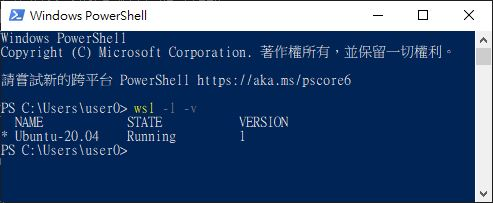
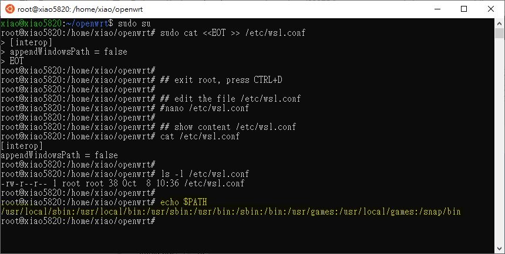

# Openwrt_Ubuntu_20.04_setup

Openwrt_Ubuntu_20.04_setup  
  
Win10 2004 + Intel CPU + Ubuntu 20.04 used, how to, here (https://github.com/xiaolaba/Win10_install_Ubuntu)  
real machine with Ubuntu 20.04 should works too..  

WSL 1 (Windows Subsystem for Linux 1) used only, WSL 2 no test yet. Win10, powershell, command following to tell which version of WSL, 
```  
wls -l -v
```  
result,  
  
.  
.  


```  
git clone https://github.com/openwrt/openwrt
sudo apt-get update
sudo apt-get -y install subversion g++ zlib1g-dev build-essential git \
python python3 python3-distutils libncurses5-dev gawk gettext unzip \
file libssl-dev wget libelf-dev ecj fastjar java-propose-classpath

#
sudo apt-get -y install subversion build-essential libncurses5-dev \
zlib1g-dev gawk git ccache gettext libssl-dev xsltproc zip

#
sudo apt-get -y install asciidoc binutils bzip2 gawk gettext libncurses5-dev \
libz-dev patch  zlib1g-dev lib32gcc1 libc6-dev-i386 subversion flex uglifyjs \
git-core gcc-multilib p7zip p7zip-full msmtp texinfo libglib2.0-dev xmlto \
qemu-utils upx autoconf automake libtool autopoint device-tree-compiler \
g++-multilib antlr3 gperf
#

sudo update-alternatives --install /usr/bin/python python /usr/bin/python2 1  
sudo update-alternatives --install /usr/bin/python python /usr/bin/python3 2  
sudo update-alternatives --list python  
sudo update-alternatives --config python  
python -V  
cd ~/openwrt
./scripts/feeds update -a
./scripts/feeds install -a
make menuconfig
make
```  
  
  
the make & build is in processing,  it may take few hours to completion, depends on PC and hardware rating,

  


  
jsut in case, if you want to delete project files, this will help,
```  
sudo rm -r ~/openwrt
```  


this is the issue and the first time of build but failed, really no idea what was it saying, looking for help,
https://forum.openwrt.org/t/make-2-package-makefile-package-install-error-1/76162
```  
Configuring ca-bundle.
Configuring kmod-ipt-offload.
Configuring urngd.
Configuring ppp-mod-pppoe.
Setting flags for package libc to hold.
Setting flags for package libgcc1 to hold.
Setting flags for package libpthread to hold.
cp -fpR /home/xiao/openwrt/build_dir/target-mips_24kc_musl/root-ath79 /home/xiao/openwrt/build_dir/target-mips_24kc_musl/root.orig-ath79
Enabling boot
Enabling bootcount
Enabling cron
Enabling dnsmasq
Enabling done
Enabling dropbear
Enabling firewall
Enabling gpio_switch
Enabling led
Enabling log
Enabling network
Enabling odhcpd
Enabling sysctl
Enabling sysfixtime
Enabling sysntpd
Enabling system
Enabling umount
Enabling urandom_seed
Enabling urngd
Enabling wpad
sed -i "s/Installed-Time: .*/Installed-Time: 1602027105/" /home/xiao/openwrt/build_dir/target-mips_24kc_musl/root-ath79/usr/lib/opkg/status
rm -rf /home/xiao/openwrt/build_dir/target-mips_24kc_musl/root-ath79/tmp/*
rm -f /home/xiao/openwrt/build_dir/target-mips_24kc_musl/root-ath79/usr/lib/opkg/lists/*
rm -f /home/xiao/openwrt/build_dir/target-mips_24kc_musl/root-ath79/usr/lib/opkg/info/*.postinst*
rm -f /home/xiao/openwrt/build_dir/target-mips_24kc_musl/root-ath79/var/lock/*.lock
rm -rf /home/xiao/openwrt/build_dir/target-mips_24kc_musl/root-ath79/boot
find /home/xiao/openwrt/build_dir/target-mips_24kc_musl/root-ath79/ -mindepth 1 -execdir touch -hcd "@1602027105" "{}" +
find: The relative path 'Files/WindowsApps/CanonicalGroupLimited.Ubuntu20.04onWindows_2004.2020.812.0_x64__79rhkp1fndgsc' is included in the PATH environment variable, which is insecure in combination with the -execdir action of find.  Please remove that entry from $PATH
make[2]: *** [package/Makefile:71: package/install] Error 1
make[2]: Leaving directory '/home/xiao/openwrt'
make[1]: *** [package/Makefile:108: /home/xiao/openwrt/staging_dir/target-mips_24kc_musl/stamp/.package_install] Error 2
make[1]: Leaving directory '/home/xiao/openwrt'
make: *** [/home/xiao/openwrt/include/toplevel.mk:236: world] Error 2
xiao@xiao5820:~/openwrt$ $echo $PATH
-bash: /home/xiao/.local/bin:/usr/local/sbin:/usr/local/bin:/usr/sbin:/usr/bin:/sbin:/bin:/usr/games:/usr/local/games:/mnt/c/Program: No such file or directory
```  


### why make[2]: *** [package/Makefile:71: package/install] Error 1
Windows Subsystem for Linux (WLS) is NOT OFFICIALLY supported, this is what Openwrt's statement today.
and try this workaround to disable WSL path, it works.

```  
## Windows Subsystem for Linux is NOT OFFICIALLY supported.
## https://forum.openwrt.org/t/make-2-package-makefile-package-install-error-1/76162
## https://openwrt.org/docs/guide-developer/build-system/wsl
## build /etc/wsl.conf

## uses root, otherwise cannot create /etc/wsl.conf
## password will be asked
sudo su  

sudo cat <<EOT >> /etc/wsl.conf  
[interop]
appendWindowsPath = false  
EOT

## exit root, press CTRL+D

## edit the file /etc/wsl.conf, not used
#nano /etc/wsl.conf

## show content /etc/wsl.conf  
cat /etc/wsl.conf

ls -l /etc/wsl.conf

echo $PATH


```  
.  
.  
exit from root, back to user account privilege, just press CTRL+D,  
this is terminal output, not reboot PC yet.  
  


In Win10, uses regedit.exe, change the registry, find this reg key,   
{GUID} may vary with different PC or differnt session of Ubuntu installation.   
```
HKEY_CURRENT_USER\Software\Microsoft\Windows\CurrentVersion\Lxss\{GUID}\Flags  
```
  


change "Flags"=dword:0000007 to "Flags"=dword:0000005  

.  
the backup the registry with "Flags"=dword:0000007,  

```  
Windows Registry Editor Version 5.00

[HKEY_CURRENT_USER\SOFTWARE\Microsoft\Windows\CurrentVersion\Lxss\{bd856851-be16-4939-bcdb-d9c41948229f}]
"State"=dword:00000001
"DistributionName"="Ubuntu-20.04"
"Version"=dword:00000002
"BasePath"="C:\\Users\\user0\\AppData\\Local\\Packages\\CanonicalGroupLimited.Ubuntu20.04onWindows_79rhkp1fndgsc\\LocalState"
"Flags"=dword:00000007
"DefaultUid"=dword:000003e8
"PackageFamilyName"="CanonicalGroupLimited.Ubuntu20.04onWindows_79rhkp1fndgsc"
"KernelCommandLine"="BOOT_IMAGE=/kernel init=/init"
"DefaultEnvironment"=hex(7):48,00,4f,00,53,00,54,00,54,00,59,00,50,00,45,00,3d,\
  00,78,00,38,00,36,00,5f,00,36,00,34,00,00,00,4c,00,41,00,4e,00,47,00,3d,00,\
  65,00,6e,00,5f,00,55,00,53,00,2e,00,55,00,54,00,46,00,2d,00,38,00,00,00,50,\
  00,41,00,54,00,48,00,3d,00,2f,00,75,00,73,00,72,00,2f,00,6c,00,6f,00,63,00,\
  61,00,6c,00,2f,00,73,00,62,00,69,00,6e,00,3a,00,2f,00,75,00,73,00,72,00,2f,\
  00,6c,00,6f,00,63,00,61,00,6c,00,2f,00,62,00,69,00,6e,00,3a,00,2f,00,75,00,\
  73,00,72,00,2f,00,73,00,62,00,69,00,6e,00,3a,00,2f,00,75,00,73,00,72,00,2f,\
  00,62,00,69,00,6e,00,3a,00,2f,00,73,00,62,00,69,00,6e,00,3a,00,2f,00,62,00,\
  69,00,6e,00,3a,00,2f,00,75,00,73,00,72,00,2f,00,67,00,61,00,6d,00,65,00,73,\
  00,3a,00,2f,00,75,00,73,00,72,00,2f,00,6c,00,6f,00,63,00,61,00,6c,00,2f,00,\
  67,00,61,00,6d,00,65,00,73,00,00,00,54,00,45,00,52,00,4d,00,3d,00,78,00,74,\
  00,65,00,72,00,6d,00,2d,00,32,00,35,00,36,00,63,00,6f,00,6c,00,6f,00,72,00,\
  00,00,00,00


```  
.  

see previous error log & registry key, same string, CanonicalGroupLimited.Ubuntu20.04onWindows_2004.2020.812.0_x64__79rhkp1fndgsc  
```  
Find: The relative path 'Files/WindowsApps/CanonicalGroupLimited.Ubuntu20.04onWindows_2004.2020.812.0_x64__79rhkp1fndgsc' is included in the PATH environment variable, which is insecure in combination with the -execdir action of find.  Please remove that entry from $PATH
```  


time to reboot the PC, and then build again,
```  
make j=1 V=Sc

```  
.  
wowla, job done, built succeed. thanks to [Kar200](https://forum.openwrt.org/u/kar200) who has advised this solution.

  
